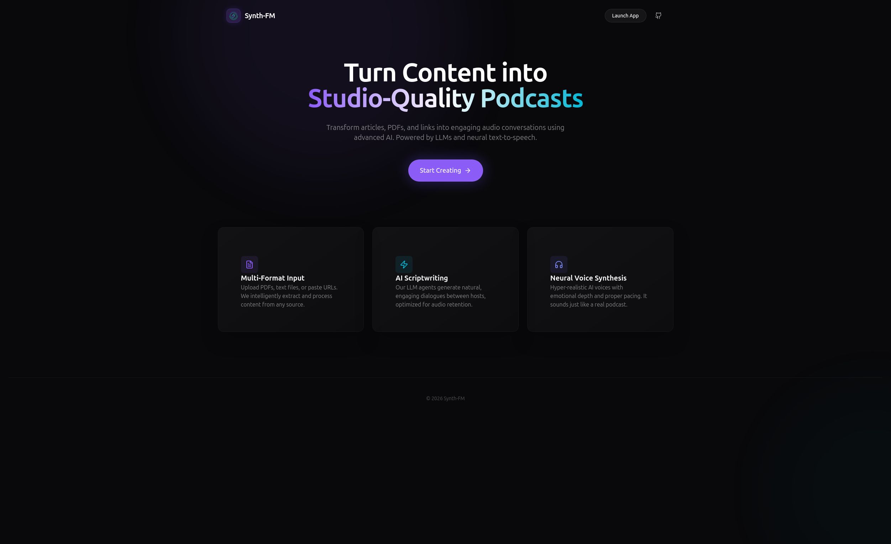
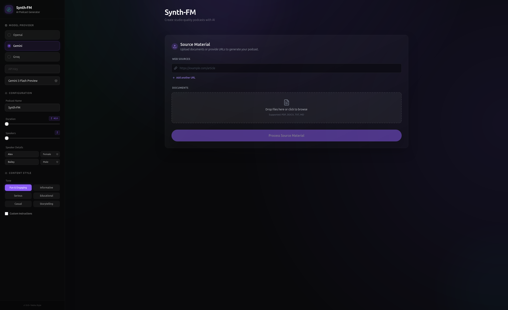
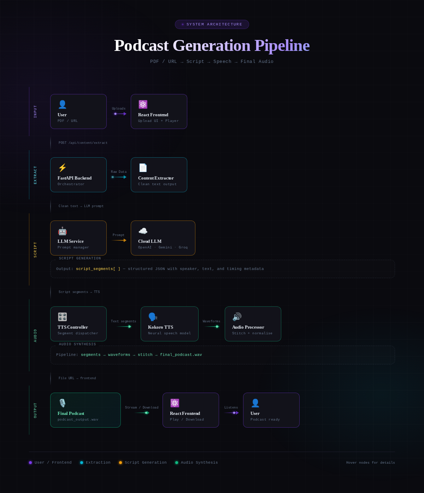
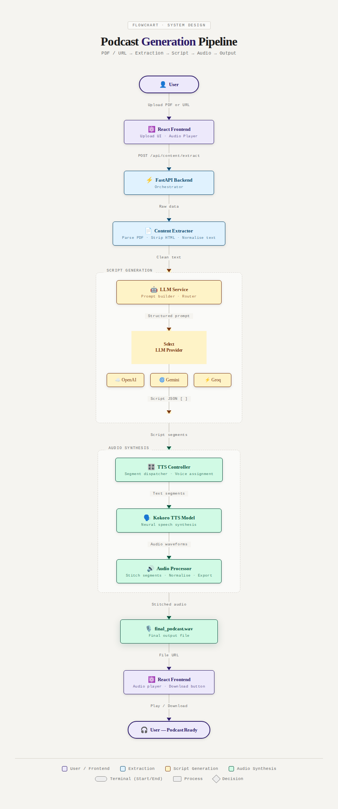

# 🎙️ Synth-FM: AI-Powered Podcast Generator
 
> [!IMPORTANT]
> **Live Demo:** [**https://synth-fm.netlify.app/**](https://synth-fm.netlify.app/)




**Synth-FM** is an advanced AI audio synthesis platform that transforms written content—articles, research papers, documentation, and blog posts—into professional-quality podcasts. It orchestrates a pipeline of state-of-the-art technologies:
*   **LLMs** (OpenAI, Gemini, Groq, Local Llama) script the conversation.
*   **Kokoro TTS** (High-Fidelity) synthesizes realistic voices.
*   **FastAPI & React** provide a seamless, modern user experience.

---

## Key Features

-   **Natural Multi-Speaker Conversations**: Automatically generates dynamic dialogue between hosts (e.g., *The Enthusiast*, *The Skeptic*, *The Expert*) with distinct personalities.
-   **Multi-Source Ingestion**:
    -   **URLs**: Paste links from Medium, Substack, News sites, etc.
    -   **Documents**: Upload PDF, DOCX, TXT, or MD files.
-   ** Flexible AI Models**:
    -   **Cloud**: OpenAI (GPT-4o), Google Gemini 1.5 Flash/Pro, Groq (Llama 3 8b).
    -   **Local**: Run completely offline with **Llama 3.2 (1B/3B)** and **Qwen 2.5** (requires GPU).
-   ** High-Fidelity Audio**: Powered by **Kokoro TTS** (via Onnx/PyTorch) for realistic voice synthesis that rivals human speech.
-   **Modern Architecture**: Built with a robust **FastAPI** backend and a reactive **React + Vite** frontend.
-   **Memory Management**: Smart VRAM management to load/unload local LLM models dynamically during generation.



---

## System Architecture

The following diagram illustrates the data flow from user input to the final podcast audio file.






---

## Tech Stack

### Frontend
-   **Framework**: [React](https://react.dev/) + [Vite](https://vitejs.dev/)
-   **Styling**: [Tailwind CSS](https://tailwindcss.com/) + [Lucide React](https://lucide.dev/) (Icons)
-   **State Management**: React Hooks
-   **HTTP Client**: Axios

### Backend
-   **Framework**: [FastAPI](https://fastapi.tiangolo.com/) (Python 3.10+)
-   **Server**: Uvicorn
-   **AI Orchestration**: Custom Python Modules (`utils/llm.py`)
-   **TTS**: **Kokoro** (High-quality offline TTS)
-   **Data Processing**: `Trafilatura` (Web Scraping), `PyPDF2`, `python-docx`

---

## Usage Guide

1.  **Select Your Content**: Paste URLs or upload documents/PDFs on the landing page.
2.  **Configure Settings**:
    *   **LLM Provider**: Choose your preferred Cloud Provider(OpenAI/Gemini/Groq) and pass the API key.
    *   **Model Name**: Choose the model name (gpt-4o, gemini-1.5-flash, qwen2.5-coder, etc).
    *   **Duration**: Choose how long you want the episode to be.
    *   **Num Speakers**: Choose the number of speakers (2, 3, or 4).
    *   **Podcast Style**: set the tone (Funny, Serious, Debate).

3.  **Generate Script**: Click "Generate". The AI will draft a conversation. *You can review the script before synthesis.*
4.  **Synthesize Audio**: The system will use Kokoro TTS to voice the script.

5.  **Listen & Share**: Play the final podcast in the built-in player or download it.

---

## Project Structure

```
synth-fm/
├── backend/                # FastAPI Application & Logic
│   ├── api/                # API Routers (endpoints)
│   ├── utils/              # Core Logic (LLM, TTS, Extraction)
│   ├── main.py             # Entry Point
│   └── environment.yml     # Dependencies
├── frontend/               # React Application
│   ├── src/
│   │   ├── components/     # UI Components
│   │   ├── pages/          # Screens
│   │   └── lib/            # Utilities
├── data/                   # Local Storage
│   ├── temp/               # Temporary Audio Segments
│   └── output/             # Final Podcasts
└── README.md               # You are here
```

---

## 🗺️ Roadmap

- [ ] **Mobile App**: React Native version.
- [ ] **RSS Feeds**: Personal podcast feeds.
- [ ] **Voice Cloning**: Fine-tune TTS with custom voice samples.
- [ ] **User Accounts**: History and preferences.

---

## 📄 License

Distributed under the MIT License. See `LICENSE` for more information.

---

